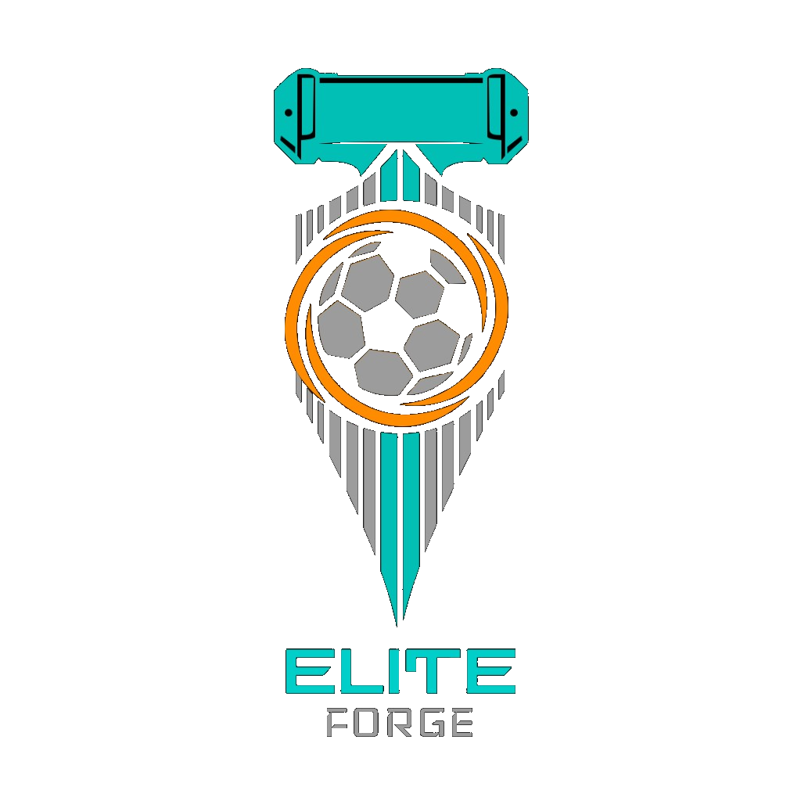
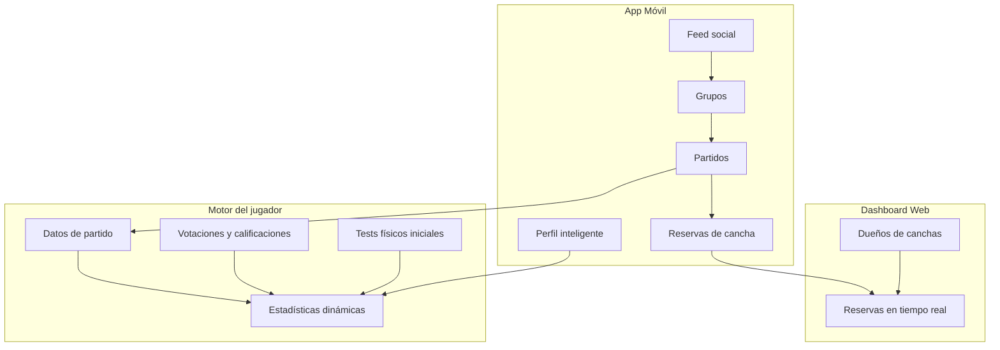

# Elite Forge — Documentación del Producto

## ¿Qué es Elite Forge?

**Elite Forge** es una aplicación móvil de fútbol que combina:

- Un **perfil de jugador inteligente** que evoluciona con cada partido.
- Una **red social deportiva** con feed, amistades y grupos.
- **Organización de partidos** con invitaciones, cupos y formatos configurables.
- **Reservas de canchas** conectadas a un dashboard web para dueños de instalaciones.

El repositorio `EF` contiene el monorepo técnico (mobile, backend, infraestructura) que soporta esta plataforma.

---

## Logo e identidad de marca



### Ubicación del asset (reutilizable)

| Ubicación | Uso |
|-----------|-----|
| `docs/assets/elite-forge-logo.png` | **Fuente oficial** del repositorio y documentación |
| `apps/mobile/assets/images/elite-forge-logo.png` | App móvil (importado por `EliteForgeLogo`) |

En código React Native:

```tsx
import { EliteForgeLogo } from "@/components/ui"

<EliteForgeLogo />
```

### Composición del logo (versión actual)

| Elemento | Descripción | Color |
|----------|-------------|-------|
| Fondo | **Transparente** (sin color de fondo en el PNG) | — |
| Barra superior | Pieza tipo yunque / martillo con detalles geométricos | Verde Esmeralda `#00CEC8` |
| Escudo / yunque | Franjas verticales centradas que convergen en punta inferior | Centro `#00CEC8`, laterales gris |
| Balón central | Balón de fútbol con paneles definidos | Gris + negro |
| Anillo dinámico | Espiral de energía alrededor del balón | Naranja Oscuro `#FF8C00` |
| Tipografía **ELITE** | Nombre principal, mayúsculas, estilo futurista | Verde Esmeralda `#00CEC8` |
| Tipografía **FORGE** | Subtítulo bajo ELITE | Gris medio |

### Estilo visual

Estética **futurista e industrial** que fusiona el concepto de *forja* (yunque, metal, energía) con el fútbol (balón, dinamismo). Diseño vertical y simétrico, pensado para fondos oscuros — idealmente **Gris Carbón `#424242`**.

> **Formato del asset:** PNG con canal alpha (fondo transparente). Si al adjuntar el logo en el chat o exportarlo desde ciertas herramientas el archivo pierde transparencia, el fondo puede aplanarse a negro y verse como un recuadro en la app. El asset oficial en `docs/assets/` conserva transparencia real.

---

## Visión general del producto



---

## Módulos funcionales

### 1. Perfil de jugador inteligente

El perfil es el núcleo de Elite Forge. Aprende y evoluciona con el tiempo.

#### Datos visibles en el perfil

| Campo | Descripción |
|-------|-------------|
| Foto | Avatar del jugador |
| Nombre | Nombre completo o display name |
| Posición | Posición en cancha |
| Tag ID | Identificador único para agregar amigos fácilmente |
| Información personal | Datos configurables del perfil |
| Estadísticas | Radar / métricas de rendimiento |
| Grupos | Sección compacta con grupos a los que pertenece |
| Partidos recientes | Últimos partidos jugados |
| Reservas | Canchas reservadas vinculadas a partidos |

#### Motor de estadísticas

1. **Estadísticas iniciales** — Generadas por **tests físicos** al registrarse o al repetirlos.
2. **Crecimiento real** — Basado en el desempeño en partidos: goles, pases, votaciones, calificaciones de otros jugadores y métricas del partido.
3. **Evolución** — Las estadísticas **suben o bajan** según el rendimiento sostenido.

#### Tests físicos

- Opcionales para el usuario.
- Se pueden **repetir una vez al mes** como máximo.
- Al completarse, actualizan la línea base de estadísticas físicas.

#### Privacidad del perfil

El dueño del perfil puede **administrar qué ven sus amigos** (visibilidad de partidos, estadísticas, grupos, etc.).

---

### 2. Red social y feed

| Funcionalidad | Descripción |
|---------------|-------------|
| **Feed principal** | Pantalla central tipo Facebook: actividad, publicaciones y novedades de la red |
| **Amistades** | Enviar, aceptar y **eliminar** solicitudes de amistad |
| **Perfil de amigos** | Ver partidos y desempeño de amigos ya añadidos (según permisos de privacidad) |
| **Tag ID** | Buscar y agregar jugadores por identificador único |

---

### 3. Grupos

Los grupos son comunidades de jugadores que organizan partidos juntos.

#### Roles

| Rol | Permisos |
|-----|----------|
| **Líder** | Creador del grupo; control total |
| **Administrador** | Asignado por el líder; puede ayudar a gestionar (según reglas definidas) |
| **Miembro** | Participa en el grupo y en partidos |

#### Reglas de negocio

- Un usuario puede pertenecer a **múltiples grupos** simultáneamente.
- Solo el **líder o administrador** puede **crear partidos** e **invitar** a integrantes del grupo.
- Los miembros pueden recibir **invitaciones para unirse a grupos** (además de las de amistad).

---

### 4. Partidos (Matches)

#### Creación y organización

- Solo **líder o administrador** del grupo crea partidos.
- Al crear un partido, los integrantes del grupo reciben una **notificación de invitación** para unirse.
- Cada partido tiene un **tope de jugadores** configurable (ej. 8v8, 11v11, etc.).

#### Visibilidad

| Contexto | Qué se ve |
|----------|-----------|
| Sección **Mis partidos** | Solo partidos del usuario |
| Sección **Partidos de mis grupos** | Partidos de los grupos a los que pertenece |
| **Perfil de un amigo** | Partidos y desempeño del amigo (si el dueño lo permite) |

#### Historial y calendario

- Los partidos aparecen dentro del **grupo** correspondiente.
- Existe una **sección especial** con:
  - Partidos **anteriores** (historial).
  - Partidos **próximos** (calendario futuro).

#### Post-partido

Tras cada partido, el sistema registra desempeño individual (goles, pases, etc.) y recopila **votaciones y calificaciones** de otros jugadores, alimentando el perfil inteligente.

---

### 5. Reservas de canchas

| Aspecto | Descripción |
|---------|-------------|
| **App móvil** | Sección dedicada para reservar la cancha donde se jugará el partido |
| **Dashboard web** | Plataforma para **dueños de canchas** |
| **Tiempo real** | Los dueños ven reservas y cancelaciones al instante |
| **Perfil** | El usuario ve sus reservas activas en una sección del perfil |

Flujo: crear partido → reservar cancha → dueño confirma / gestiona desde el dashboard web.

---

## Mapa de pantallas (referencia)

| Área | Pantallas / secciones |
|------|----------------------|
| **Main** | Feed social |
| **Perfil** | Datos personales, stats, grupos, partidos recientes, reservas, privacidad |
| **Grupos** | Lista de grupos, detalle, miembros, roles |
| **Partidos** | Mis partidos, partidos del grupo, historial, próximos, detalle de partido |
| **Social** | Amigos, solicitudes, búsqueda por Tag ID |
| **Reservas** | Buscar cancha, reservar, mis reservas |
| **Tests** | Tests físicos (opcional, 1×/mes) |

---

## Entidades principales (modelo conceptual)

```
Usuario
├── Perfil (foto, nombre, posición, tagId, stats, privacidad)
├── Amistades (solicitudes enviadas / recibidas)
├── Tests físicos (historial, última fecha)
└── Grupos[] (membresía, rol)

Grupo
├── Líder
├── Administradores[]
├── Miembros[]
└── Partidos[]

Partido
├── Grupo (origen)
├── Formato (8v8, 11v11, etc.)
├── Cupo máximo
├── Jugadores confirmados[]
├── Cancha / Reserva
├── Estadísticas por jugador
└── Votaciones / calificaciones

Reserva
├── Cancha
├── Partido (vinculado)
├── Fecha / hora
└── Estado (confirmada, cancelada, etc.)

Cancha (gestión web)
├── Dueño
├── Disponibilidad
└── Reservas en tiempo real
```

---

## Paleta de colores

La guía completa de colores y distribución UI está en el [README principal](../README.md#sistema-de-diseño--paleta-de-colores).

| Color | Hex | Rol |
|-------|-----|-----|
| Verde Esmeralda | `#00CEC8` | Interfaz — lado izquierdo |
| Naranja Oscuro | `#FF8C00` | Interfaz — lado derecho |
| Gris Carbón | `#424242` | Background |
| Blanco Puro | `#FFFFFF` | Tipografía |

---

## Documentación técnica relacionada

| Documento | Contenido |
|-----------|-----------|
| [README.md](../README.md) | Monorepo, stack, inicio rápido, CI/CD, despliegue |
| `apps/mobile/` | App React Native (Ignite + Tamagui) |
| `apps/backend/` | Microservicios NestJS |
| `infrastructure/` | Docker, Kubernetes, AWS |
